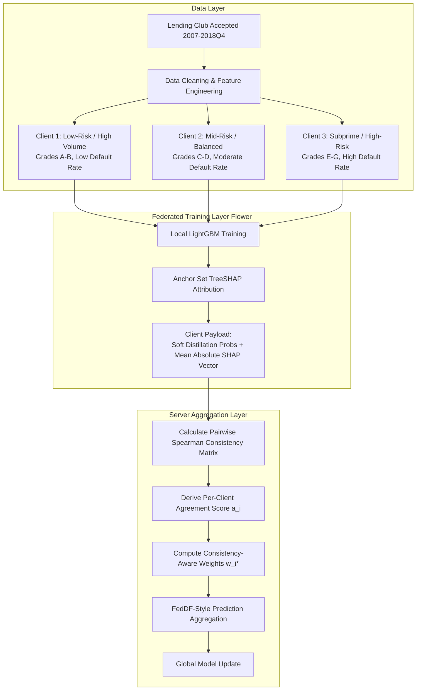

# FedTrust-Credit: Privacy-Preserving Credit Risk Assessment with Explanation-Consistency-Aware Aggregation

[](https://www.python.org/)
[](https://flower.ai/)
[](https://lightgbm.readthedocs.io/)
[](https://shap.readthedocs.io/)
[](tests/)

A cross-silo Federated Learning (FL) framework designed for credit risk assessment under non-IID loan portfolios. **FedTrust-Credit** augments standard FedAvg by incorporating client-side model explainability (TreeSHAP) into the server aggregation mechanism, dynamically scaling client weights based on consensus and feature attribution agreement.

---

## 🏛️ Project Context

- **Institution**: School of Computer Science Engineering and Information Systems (SCORE), Department of Information Technology, VIT Vellore
- **Course**: Cloud Computing (BITE412L)
- **Authors**:
  - Prashaanth Raj J M (`23BIT0173`)
  - Prasannaa V (`23BIT0041`)
  - Haswanth K (`23BIT0359`)
- **Advisor**: Dr. Siva Rama Krishnan S (Associate Professor Grade 1, VIT Vellore)

---

## 📌 Problem & Motivation

Credit risk models built across independent lending institutions face two fundamental barriers:
1. **Data Privacy & Regulatory Restrictions**: Raw customer financial records cannot be pooled centrally due to privacy laws (GDPR, Fair Lending regulations, banking secrecy).
2. **Extreme Non-IID Skew**: Lending institutions operate across diverse demographics, credit grades (prime vs. subprime), and geographies. Models trained in isolation overfit local risk profiles, while vanilla federated learning (FedAvg) aggregates models purely based on sample counts, blind to divergent or uninterpretable decision surfaces.

**FedTrust-Credit** introduces **Explanation-Consistency-Aware Aggregation**:
- In each round, clients compute local feature importances on a reference anchor distribution using **TreeSHAP**.
- The server evaluates pairwise Spearman rank correlation of feature rankings among participating institutions.
- Clients showing higher consensus with peer explanations receive an upweighted contribution via a tuned `CONSISTENCY_GAIN` parameter.

---

## 🏗️ Architecture & Pipeline



---

## 🔬 Key Experimental Results

Benchmarked across 20 federated communication rounds using 1,344,976 cleaned loan records from the Lending Club dataset:

### 1. Comparative Performance Summary

| Metric | Centralized Baseline | Plain FedAvg ($\gamma=0.0$) | FedTrust-Credit ($\gamma=1.0$) |
|:---|:---:|:---:|:---:|
| **Pooled Accuracy** | **0.8284** | 0.8257 | 0.8257 |
| **Pooled ROC-AUC** | **0.7225** | 0.6565 | 0.6565 |
| **Pooled Macro F1** | 0.0943 | 0.1187 | **0.1186** |
| **Final Consistency Score** | 0.7620 | 0.8123 | **0.8141** |
| **Steady-State Consistency** | 0.7620 | 0.8114 | **0.8118** |
| **Fairness (Acc Spread)** | 0.1783 | 0.1881 | 0.1887 |
| **Comm Overhead / Round** | N/A | 3,188,672 bytes | 3,189,680 bytes (**+0.0316%**) |

### 2. Hyperparameter Sensitivity Sweep (`CONSISTENCY_GAIN` $\gamma$)

Evaluating $\gamma \in \{0.0, 0.5, 1.0, 2.0, 5.0, 10.0\}$ over 20 rounds each revealed that:
- Baseline attribution consistency across non-IID partitions is naturally high ($\sim 0.81$).
- Explanation consistency remains in the narrow band $[0.8114, 0.8128]$ ($\le 0.17\%$ variance) across all gain factors.
- Classification accuracy, AUC, and F1 remain rock-stable with **zero degradation**.
- Weight adjustment per client is bounded by $\le 0.84\%$ due to the high pairwise base agreement across clients.
- Explanation transmission requires only **1,008 bytes per client per round**, representing a negligible **0.0316%** communication overhead.

---

## 📊 Visualizations

All generated plots from real test evaluations are stored in `results/plots/`:

- **Explanation Consistency Progression**: `results/plots/consistency_comparison.png`
- **Pooled Model Accuracy**: `results/plots/accuracy_comparison.png`
- **ROC-AUC Convergence**: `results/plots/auc_comparison.png`
- **Per-Client Macro F1**: `results/plots/per_client_f1.png`
- **Institutional Fairness Spread**: `results/plots/fairness_spread.png`
- **Communication Overhead Comparison**: `results/plots/communication_overhead.png`

---

## 📁 Repository Layout

```
fedtrust-credit/
├── docs/
│   ├── BUILD_PLAN.md               # Phased development plan with completion gates
│   ├── PROGRESS.md                 # Running engineering and execution log
│   ├── DECISIONS.md                # Architectural Decision Records (ADRs) for patent trail
│   └── initial_review_report.md    # Full project review specification & report
├── results/
│   ├── centralized_baseline/       # Centralized pooled training logs & metrics
│   ├── fedavg_baseline/            # Plain FedAvg 20-round execution logs
│   ├── consistency_aware/          # FedTrust-Credit 20-round execution logs
│   ├── gain_sweep/                 # Hyperparameter sweep across gamma in [0.5, 2.0, 5.0, 10.0]
│   ├── plots/                      # Publication-quality benchmark visualization charts
│   ├── full_metrics_summary.json   # Machine-readable evaluation collation
│   └── RESULTS_SUMMARY.md          # Scientific experimental synthesis
├── src/
│   ├── data_partition.py           # Lending Club loader, preprocessor & non-IID partitioner
│   ├── local_training.py           # Client-side LightGBM training wrapper
│   ├── explanation.py              # TreeSHAP computation & pairwise Spearman rank scoring
│   ├── aggregation.py              # Consistency-aware aggregation mathematics
│   ├── federation_flower.py        # Flower simulation clients & custom FedAvg strategy
│   ├── centralized_baseline.py     # Centralized baseline runner
│   ├── run_experiment.py           # CLI runner for federated variants
│   └── evaluation.py               # Evaluation, metrics generation, and plotting suite
├── tests/
│   └── test_consistency_score.py   # Unit tests for scoring logic & edge cases
├── download_lending_club.sh        # Kaggle API automated dataset download script
├── requirements.txt                # Python package dependencies
└── README.md                       # Project documentation
```

---

## 🚀 Getting Started

### 1. Prerequisites & Installation

```bash
git clone https://github.com/Prasannaa-V/fedtrust-credit.git
cd fedtrust-credit

python3 -m venv .venv
source .venv/bin/activate
pip install -r requirements.txt
```

### 2. Dataset Preparation

Download the Lending Club 2007-2018Q4 dataset via Kaggle or place `accepted_2007_to_2018Q4.csv` into `data/lending_club/`:

```bash
# Automated download via Kaggle CLI:
bash download_lending_club.sh

# Run non-IID partitioning:
python src/data_partition.py "data/lending_club/loan.csv"
```

### 3. Running Unit Tests

```bash
pytest tests/
```

### 4. Running Experiments

```bash
# Centralized pooled baseline:
python src/centralized_baseline.py

# Plain FedAvg federated baseline (gamma = 0.0):
python src/run_experiment.py --variant fedavg --rounds 20

# FedTrust-Credit Consistency-Aware Aggregation (gamma = 1.0):
python src/run_experiment.py --variant ours --rounds 20 --consistency-gain 1.0

# Generate metrics and plots:
python src/evaluation.py
```

---

## 📜 Patent Trail & Architectural Decision Records

Every algorithmic design decision, math formulation, and hyperparameter justification is documented in [docs/DECISIONS.md](docs/DECISIONS.md) under formal ADRs (D-001 through D-018) for intellectual property and patent trail integrity.

---

## 📄 License

This project is licensed under the MIT License - see the [LICENSE](LICENSE) file for details.
