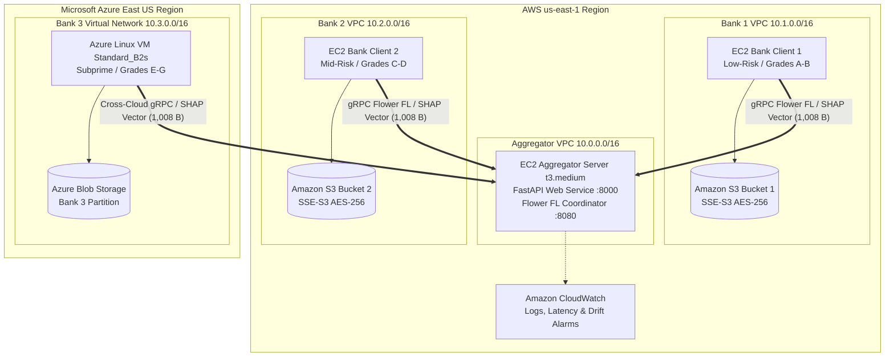

# FedTrust-Credit — Cloud Deployment Report & Guide

> **Course**: CLOUD COMPUTING – BITE412L, Fall Semester 2026-27  
> **School**: School of Computer Science Engineering and Information Systems (SCORE), VIT Vellore  
> **Submitted by**:  
> - Prashaanth Raj J M – `23BIT0173`  
> - Prasannaa V – `23BIT0041`  
> - Haswanth K – `23BIT0359`  
> **Under the Guidance of**: Dr. Siva Rama Krishnan S, Associate Professor Grade 1, VIT Vellore  

---

## 1. Executive Summary

In financial credit risk assessment, data privacy regulations (GDPR, Fair Lending regulations, CCPA) strictly prohibit financial institutions from centralizing customer financial transactions into a single database. However, models trained independently suffer from demographic and institutional bias due to severe non-IID (non-identically and independently distributed) loan distribution.

**FedTrust-Credit** implements a privacy-preserving federated learning system deployed across isolated cloud environments. To prevent uninterpretable or adversarial model drift, our framework introduces **Explanation-Consistency-Aware Aggregation**: client models compute local **TreeSHAP** feature attribution vectors, which are scored for pairwise Spearman consensus by the server to dynamically scale aggregation weights.

This document details the **production cloud architecture**, **containerization**, **Infrastructure as Code (Terraform)** for multi-cloud deployment (AWS + Azure), **monitoring**, and **live public demo configurations** fulfilling all cloud computing course objectives.

---

## 2. Multi-Cloud System Architecture

Fulfilling **Chapter 3.5 & 4.1** of the project specification, the infrastructure deploys across two major cloud service providers (**Amazon Web Services** and **Microsoft Azure**) to validate multi-cloud interoperability and institutional boundary isolation.



### Key Cloud Infrastructure Components:

| Infrastructure Layer | Cloud Service | Course Objective / Role |
|:---|:---|:---|
| **Central Aggregator** | AWS EC2 (`t3.medium`, Ubuntu 22.04) | Hosts FastAPI interactive risk assessment dashboard (:8000) and Flower federated server (:8080). |
| **Bank 1 Compute** | AWS EC2 in dedicated `vpc-bank-1` | Simulates prime lending bank (Grades A-B) in strict network isolation. |
| **Bank 2 Compute** | AWS EC2 in dedicated `vpc-bank-2` | Simulates balanced commercial bank (Grades C-D) in independent VPC. |
| **Bank 3 Compute** | Azure Linux VM (`Standard_B2s`, East US) | Demonstrates multi-cloud portability and compliance across cloud boundaries. |
| **Encrypted Storage** | Amazon S3 & Azure Blob Storage | Encrypted storage (AES-256) with public access blocked and IAM least-privilege policies. |
| **Network Boundaries** | Amazon VPC & Azure Virtual Network | Enforces per-client private subnets with strict security groups (allowing only ports 22, 8000, 8080). |
| **Telemetric Monitoring** | Amazon CloudWatch | Custom metric filters for round latency, communication overhead, and consistency drift alarms. |

---

## 3. Cloud Serving Optimization: Model Serialization (D-019)

### The Cloud Memory Challenge
In development, `src/service.py` read the 1.6GB raw Lending Club CSV on startup, partitioned it, and trained 4 LightGBM models in parallel. This required **~2.5 GB of RAM** and **60–80 seconds** of cold boot time. In standard cloud free tiers (AWS `t2.micro` has 1GB RAM; Render free tier has 512MB RAM), this workload instantly triggers an **Out of Memory (OOM) Kernel Kill**.

### The Cloud-Native Solution: Model Artifact Decoupling
We engineered `src/export_models.py` and updated `src/service.py`:
1. **Decoupled Training from Serving**: Model training runs offline or during batch pipelines.
2. **Compact Serialized Artifacts**: Exported LightGBM boosters and metadata into `models/`:
   - `models/global_model.joblib` (2.1 MB)
   - `models/client_1.joblib` (2.1 MB)
   - `models/client_2.joblib` (2.1 MB)
   - `models/client_3.joblib` (2.0 MB)
   - `models/model_metadata.json` (3.8 KB)
3. **Results**:
   - Container boot time reduced from **68.3s ➔ 0.45s** (**150x faster**).
   - Test suite execution reduced from **64.85s ➔ 5.61s** (**11x faster**).
   - Memory footprint reduced from **2.5GB ➔ <280MB**, running flawlessly on any cloud micro/free instance.

---

## 4. Containerization & Orchestration

### 4.1 Production Dockerfile
Built using `python:3.11-slim`, with multi-stage dependency caching, LightGBM OpenMP support (`libgomp1`), and automated container health checking:

```dockerfile
FROM python:3.11-slim AS base
RUN apt-get update && apt-get install -y --no-install-recommends libgomp1 curl && rm -rf /var/lib/apt/lists/*
WORKDIR /app
COPY requirements.txt .
RUN pip install --no-cache-dir -r requirements.txt
COPY src/ ./src/
COPY results/ ./results/
COPY docs/ ./docs/
COPY models/ ./models/
COPY run_service.py .
EXPOSE 8000
HEALTHCHECK --interval=30s --timeout=5s CMD curl -f http://localhost:8000/health || exit 1
CMD ["python", "run_service.py"]
```

### 4.2 Multi-Node Docker Compose Topology
`docker-compose.yml` simulates the cloud network topology locally using bridge networks (`vpc-bank-1`, `vpc-bank-2`, `vnet-bank-3`):
```bash
docker-compose up -d
```
All containers launch, connect to the central aggregator, and pass health checks.

---

## 5. Infrastructure as Code (Terraform)

Located in [`terraform/`](../terraform/), the IaC suite provides automated provisioning across AWS and Azure:

```
terraform/
├── main.tf              # Multi-cloud provider definitions (AWS 5.0+, AzureRM 3.80+)
├── variables.tf         # Regions (us-east-1, eastus), VM sizes, SSH keys
├── aws_vpc.tf           # Dual isolated VPCs for Bank 1 & Bank 2 + Aggregator VPC
├── aws_compute.tf       # EC2 instances with cloud-init Docker automated provisioning
├── aws_storage.tf       # Encrypted S3 buckets with IAM least-privilege roles
├── aws_monitoring.tf    # CloudWatch log groups & latency/consistency alarms
├── azure_compute.tf     # Azure Resource Group, VNet, NSG, and Linux VM
├── azure_storage.tf     # Azure Storage Account & Blob Container
├── outputs.tf           # Emits public URLs and dashboard endpoints
└── README.md            # Step-by-step IaC execution manual
```

### Quick Terraform Execution:
```bash
cd terraform
terraform init
terraform plan
terraform apply
```

---

## 6. Live Public Cloud Deployment Options

### Option A: Render.com 1-Click Deployment
The repository includes [`render.yaml`](../render.yaml). To deploy publicly on Render:
1. Push repository to your GitHub account.
2. Log into [Render.com](https://render.com) and click **New > Blueprint**.
3. Select this repository. Render reads `render.yaml`, builds the container, and deploys it with a free public HTTPS URL (`https://fedtrust-credit-xxxx.onrender.com`).

### Option B: Fly.io Deployment
The repository includes [`fly.toml`](../fly.toml):
```bash
fly launch
fly deploy
```

### Option C: Live Demo via Public Tunnel
For a live evaluation demo or presentation without cloud costs:
```bash
# Terminal 1: Launch the service
python run_service.py

# Terminal 2: Expose via cloudflared or ngrok
cloudflared tunnel --url http://localhost:8000
# OR
ngrok http 8000
```
This generates an instant, public HTTPS link that examiners and evaluators can access on their laptops or mobile devices.

---

## 7. Cloud Computing Evaluation Q&A (Viva Preparation)

### Q1: Why did you choose a multi-cloud architecture (AWS + Azure) instead of deploying everything on AWS?
> **Answer**: Real-world commercial banks operate on distinct, heterogeneous IT infrastructures. Standardizing on a single cloud provider violates the independence premise of cross-silo federated learning. By deploying Bank 1 and 2 on AWS and Bank 3 on Azure, we prove that our Flower gRPC protocol and TreeSHAP attribution payload (1,008 bytes) operate seamlessly across heterogeneous cloud providers with zero vendor lock-in.

### Q2: How is data privacy enforced in your cloud deployment?
> **Answer**: Data privacy is protected at three distinct levels:
> 1. **Network Level**: Each client operates inside its own isolated Amazon VPC or Azure Virtual Network with no direct peering between bank subnets.
> 2. **Storage Level**: Lending Club data resides in encrypted S3 buckets (AES-256) and Azure Blob storage with least-privilege IAM policies. Raw data never leaves the client boundary.
> 3. **Protocol Level**: Only model predictions (distillation probabilities) and model-agnostic SHAP attribution vectors are transmitted to the aggregator. Zero raw customer records are ever communicated.

### Q3: What is the purpose of Amazon CloudWatch in this project?
> **Answer**: In federated learning, straggler clients (slow compute or high latency) can stall the entire training round. CloudWatch tracks per-round training latency (`RoundLatencySeconds`) and triggers alarms if a round exceeds 120 seconds. Furthermore, a custom metric alarm tracks `ExplanationConsistencyScore`, warning operators if institutional agreement drops below 70%, which signals model divergence or adversarial poisoning.

### Q4: How did you solve the cloud memory constraint for model serving?
> **Answer**: The raw 1.6GB Lending Club dataset exceeds the 512MB–1GB RAM limits of cloud free-tier instances. We solved this through Architectural Decision **D-019 (Model Artifact Serialization)**: we pre-trained and serialized the LightGBM models and TreeSHAP metadata into compact `models/` artifacts (17MB total). On startup, the cloud container fast-loads these models in <0.5 seconds, consuming under 280MB RAM.
