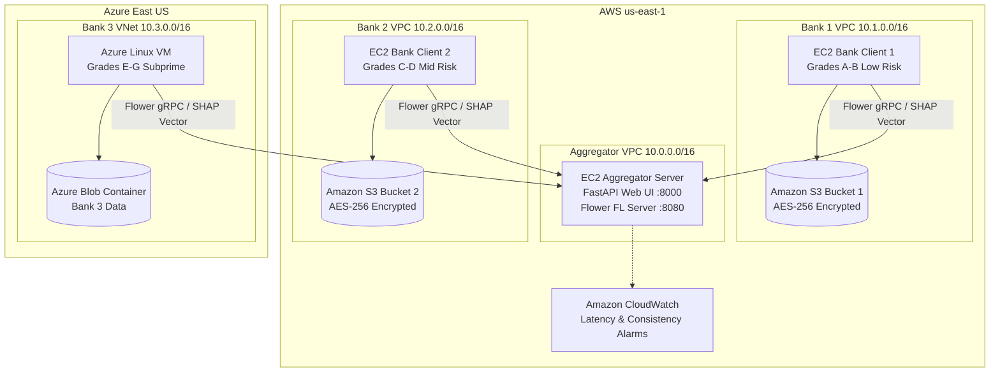

# Multi-Cloud Infrastructure as Code (Terraform) — FedTrust-Credit

> **Course**: Cloud Computing (BITE412L), VIT Vellore  
> **Architecture**: Cross-Cloud Federated Learning Infrastructure across **AWS (us-east-1)** and **Microsoft Azure (East US)**.

This directory contains modular Terraform configuration files to provision the isolated multi-cloud infrastructure specified in **Chapter 3.5 and 4.1** of the FedTrust-Credit course report.

---

## 🏛️ Infrastructure Architecture



---

## 📁 File Manifest

| File | Component | Description |
|:---|:---|:---|
| `main.tf` | Multi-Provider | Configures AWS (`hashicorp/aws ~> 5.0`) and Azure (`hashicorp/azurerm ~> 3.80`). |
| `variables.tf` | Parameters | Configurable regions, instance sizes (`t3.medium`, `Standard_B2s`), and keys. |
| `aws_vpc.tf` | Networking | Provisions 3 separate VPCs (`aggregator-vpc`, `bank1-vpc`, `bank2-vpc`) with subnets and security groups. |
| `aws_compute.tf` | Compute | Deploys Aggregator, Bank Client 1, and Bank Client 2 EC2 instances with cloud-init Docker setup. |
| `aws_storage.tf` | Storage & IAM | Encrypted S3 buckets with least-privilege IAM policies and EC2 instance profiles. |
| `aws_monitoring.tf` | Monitoring | Amazon CloudWatch log groups, metric filters, and alerting alarms for consistency drift and round latency. |
| `azure_compute.tf` | Azure Compute | Azure Resource Group, Virtual Network (`vnet-bank-3`), Subnet, NSG, and Linux VM for Bank 3. |
| `azure_storage.tf` | Azure Storage | Azure Storage Account with TLS 1.2 enforcement and private Blob Container. |
| `outputs.tf` | Endpoints | Emits public IPs, live Dashboard URL, Swagger docs, and bucket names. |

---

## 🚀 Deployment Instructions

### 1. Prerequisites
Ensure you have installed:
- [Terraform CLI](https://developer.hashicorp.com/terraform/downloads) (>= 1.5.0)
- [AWS CLI](https://aws.amazon.com/cli/) configured with credentials:
  ```bash
  aws configure
  ```
- [Azure CLI](https://learn.microsoft.com/en-us/cli/azure/install-azure-cli) logged in:
  ```bash
  az login
  ```

### 2. Generate SSH Key Pair (if needed)
```bash
ssh-keygen -t ed25519 -f ~/.ssh/fedtrust_key -N ""
```
Set the public key in `terraform.tfvars`:
```hcl
ssh_public_key = "ssh-ed25519 AAAAC3... your-key"
```

### 3. Initialize & Validate
```bash
cd terraform
terraform init
terraform validate
```

### 4. Plan & Provision
```bash
terraform plan -out=tfplan
terraform apply tfplan
```

Upon completion, Terraform will output:
```
Outputs:
aggregator_dashboard_url = "http://54.xxx.xxx.xxx:8000"
aggregator_swagger_docs  = "http://54.xxx.xxx.xxx:8000/docs"
flower_fl_grpc_endpoint  = "54.xxx.xxx.xxx:8080"
aws_bank_client_1_ip     = "54.yyy.yyy.yyy"
aws_bank_client_2_ip     = "54.zzz.zzz.zzz"
azure_bank_client_3_ip   = "20.aaa.aaa.aaa"
```

### 5. Accessing the Live Cloud Dashboard
Open `http://<aggregator_public_ip>:8000` in your web browser to interact with the credit application interface, trigger live federated aggregation rounds, and view TreeSHAP feature attributions in real time.

### 6. Clean Teardown (Avoid Cloud Charges)
Once your demonstration is complete:
```bash
terraform destroy -auto-approve
```

---

## 💰 Cost Estimation (Evaluation Demo)

| Resource | Service Type | Hours Used | Approx Cost |
|:---|:---|:---:|:---:|
| 3x AWS EC2 | `t3.medium` ($0.0416/hr each) | 2 hrs | ~$0.25 |
| 1x Azure VM | `Standard_B2s` ($0.0416/hr) | 2 hrs | ~$0.08 |
| AWS S3 & Azure Blob | Storage + Requests (<100MB) | 2 hrs | <$0.01 |
| Amazon CloudWatch | 1 Log Group + 2 Alarms | 2 hrs | <$0.01 |
| **Total Demo Cost** | | **2 hours** | **~$0.35 USD** |
